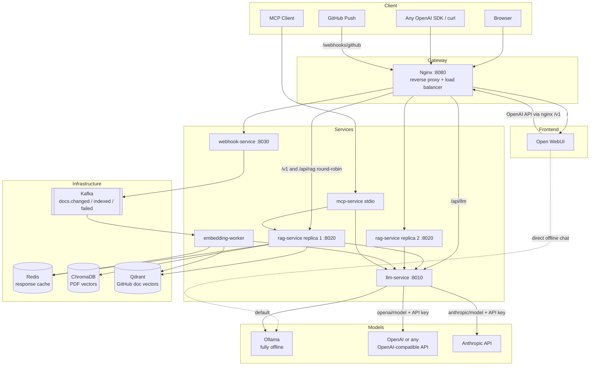
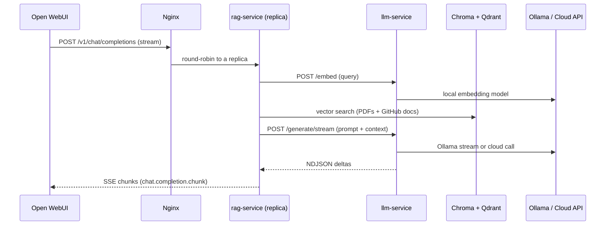
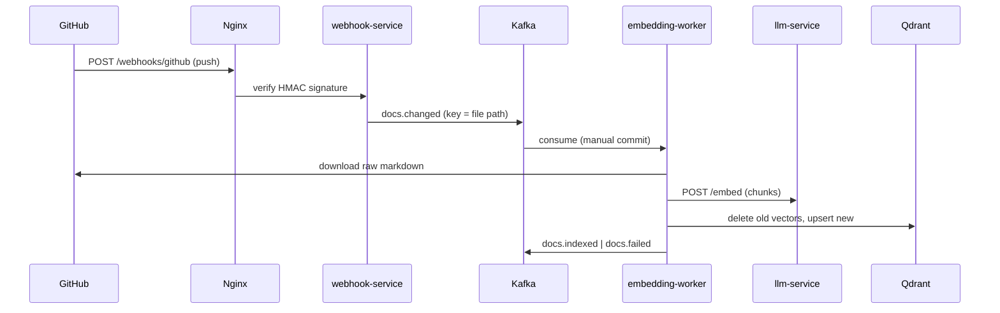

# Architecture

The LLM Dev Kit is a set of small, independently built and deployed services
behind an Nginx gateway. The only published application port is the gateway
(`:8080`). Every service has its own Docker image stage, its own dependency
set, and communicates over HTTP or Kafka — no shared in-process imports across
service boundaries (only the thin `devkit_common` library is shared at build
time).

## System Overview

## Services

### nginx (gateway / load balancer)
Single entrypoint. Routes by path and round-robins across all `rag-service`
replicas (Docker DNS returns one address per replica; nginx resolves them at
startup). SSE buffering is disabled so token streaming reaches the browser.

| Route | Target |
| --- | --- |
| `/` | Open WebUI (websockets enabled) |
| `/v1/*` | rag-service — OpenAI-compatible API |
| `/api/rag/*` | rag-service REST (prefix stripped) |
| `/api/llm/*` | llm-service REST (prefix stripped) |
| `/webhooks/*` | webhook-service |

### open-webui (frontend)
Stock `ghcr.io/open-webui/open-webui` image. Two model sources:
1. **Direct Ollama connection** — plain offline chat.
2. **OpenAI connection to `http://nginx/v1`** — every model listed there is
   answered by rag-service with retrieval-augmented context. The placeholder
   key `sk-local-rag` keeps it offline; users can add their own cloud
   connections/keys in Admin Settings → Connections.

### llm-service (model router)
The only service that talks to model backends. Providers:

- **ollama** (default, offline) — chat, streaming, embeddings.
- **openai** — any OpenAI-compatible API via `OPENAI_BASE_URL`.
- **anthropic** — Anthropic Messages API.

Model ids route by prefix: `llama3.1` → Ollama, `openai/gpt-4o` → OpenAI,
`anthropic/claude-sonnet-5` → Anthropic. Cloud calls need a key from the
environment **or** an `api_key` field on the request (bring-your-own-key —
nothing is stored). Embeddings are always local so both vector stores share
one embedding space. Errors are proper HTTP errors — they are never returned
as fake chat text and never cached.

Endpoints: `/health`, `/providers`, `/models`, `/generate`,
`/generate/stream` (NDJSON), `/embed`.

### rag-service (×2 replicas)
Chat orchestration: Redis cache check → embed query (via llm-service) →
retrieve context from **ChromaDB** (uploaded PDFs) and **Qdrant** (GitHub
docs, score-thresholded) → build prompt → generate via llm-service → cache
successful responses (keys namespaced `chat:*`, so clearing chat cache never
touches worker state).

Also serves the OpenAI-compatible `/v1/models` and `/v1/chat/completions`
(streaming SSE and non-streaming), `/ingest/pdf`, `/cache/*`, `/documents/*`.

### webhook-service
Verifies the GitHub `X-Hub-Signature-256` (HMAC) when a secret is configured,
extracts changed `.md`/`.mdx` files from push payloads, and publishes one
`docs.changed` event per file to Kafka **keyed by file path** so per-file
ordering is preserved across partitions. The Kafka producer is created once
at startup and closed on shutdown.

### embedding-worker
Kafka consumer (`embedding-workers` group, manual commits). Per event:
dedup-check in Redis → download markdown from GitHub (Redis-cached per
commit) → chunk → embed via llm-service → **delete the file's previous
vectors** → upsert into Qdrant → publish `docs.indexed`. Failures publish
`docs.failed` and the worker moves on — a poison message can never crash-loop
the consumer. Removed files delete their vectors.

### mcp-service
MCP tools (`list_models`, `ask_llm_dev_kit`) that call llm-service and
rag-service over HTTP — no direct database access.

## Chat Request Flow (RAG, streaming)

## GitHub Doc Sync Flow

## Docker Build Strategy

One `Dockerfile`, one stage per service off a shared patched `python:3.12-slim`
base:

- each stage installs **only that service's** `requirements.txt` (rag-service
  uses the thin `chromadb-client` instead of the full chromadb package);
- containers run as a non-root `appuser`;
- healthchecks use the Python stdlib (no curl in the images);
- in dev, `docker-compose.yml` bind-mounts the service source and runs
  uvicorn `--reload` for hot reload;
- `deploy.replicas: 2` on rag-service demonstrates horizontal scaling behind
  the load balancer (`docker compose up -d --scale rag-service=N`).

## Offline / Cloud Model Matrix

| Scenario | Configuration | What happens |
| --- | --- | --- |
| Fully offline (default) | no keys set | All chat + embeddings via local Ollama |
| Server-wide cloud | `OPENAI_API_KEY` / `ANTHROPIC_API_KEY` in `.env` | `openai/*`, `anthropic/*` models listed and usable by everyone |
| Bring-your-own-key | `api_key` in request body, or a real Bearer key on `/v1` | Key used for that request only, never stored |
| Alternative OpenAI-compatible host | `OPENAI_BASE_URL` | Groq/Together/vLLM/LM Studio behind the same `openai/` prefix |
