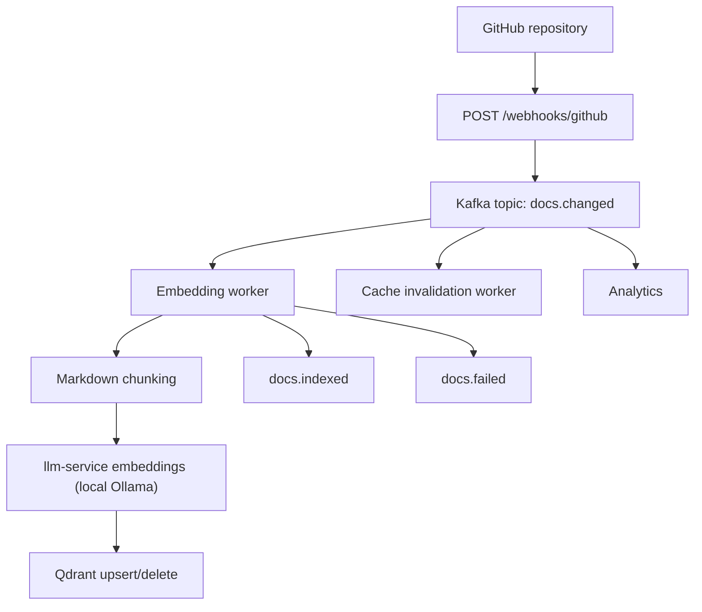
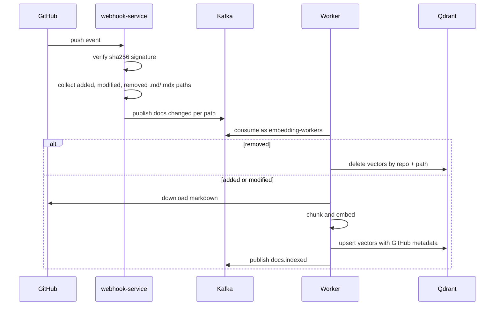

# GitHub Documentation Sync

## Architecture



## Webhook Sequence



## Topics

| Topic | Producer | Consumer | Purpose |
| --- | --- | --- | --- |
| `docs.changed` | webhook-service | `embedding-workers` | File-level document change events |
| `docs.indexed` | Embedding worker | Analytics or observability | Successful Qdrant indexing result |
| `docs.failed` | Embedding worker | Dead-letter monitoring | Failed document processing |
| `cache.invalidate` | Future cache workers | Cache worker | Explicit cache invalidation events |

Messages are JSON and use `repo`, `branch`, `path`, `commit`, `event`, and `timestamp`.

## Configuration

```bash
KAFKA_BOOTSTRAP_SERVERS=localhost:9092
KAFKA_TOPIC_DOCS_CHANGED=docs.changed
KAFKA_TOPIC_DOCS_INDEXED=docs.indexed
KAFKA_TOPIC_DOCS_FAILED=docs.failed
KAFKA_TOPIC_CACHE_INVALIDATE=cache.invalidate
GITHUB_TOKEN=ghp_...
GITHUB_WEBHOOK_SECRET=...
GITHUB_DEFAULT_OWNER=acme
GITHUB_DEFAULT_REPO=compute-central-docs
GITHUB_DEFAULT_BRANCH=main
QDRANT_URL=http://localhost:6333
QDRANT_COLLECTION=github_documents
REDIS_URL=redis://localhost:6379/0
GITHUB_CACHE_TTL=600
RETRIEVER_SCORE_THRESHOLD=0.72
```

## Local Run

```bash
docker compose up --build kafka qdrant redis llm-service webhook-service embedding-worker
```

Create a GitHub webhook pointing at `http://<host>:8080/webhooks/github`
(through the Nginx gateway), set the content type to `application/json`, and
configure the same secret in `GITHUB_WEBHOOK_SECRET`.

## Metadata

Each indexed vector stores:

```text
repo
owner
branch
path
title
url
commit
chunk_id
last_indexed
source=github
text
```

The `commit` value makes retriever freshness checks cheap. Deleted files remove
all Qdrant vectors matching `repo`, `path`, and `source=github`.
