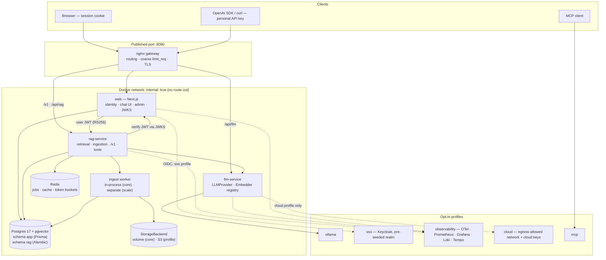

# v2 Plan — a sovereign, local-first private AI workspace

Name: **llm-dev-kit** (kept — Python core package `ldk_core`, entry-point group
`llm_dev_kit.plugins`, API key prefix `sk-ldk-`, Keycloak realm `llm-dev-kit`).
Status: **awaiting approval. No code changes beyond this document.**

This is a production refactor of `llm-dev-kit`, not a rewrite. The Next.js app,
the service split, the `ChatProvider` seam, the nginx gateway and the test suite
stay. What changes is that every swappable capability moves behind an interface
with a plugin registry, the stack becomes sovereign by default, and documents,
identity and rate limiting become per-user and enforced in the data layer.

- [1. Current state](#1-current-state)
- [2. Target architecture](#2-target-architecture)
- [3. Interfaces mapped to files](#3-interfaces-mapped-to-files)
- [4. Key decisions](#4-key-decisions)
- [5. Migration plan](#5-migration-plan)
- [6. Risks](#6-risks)
- [7. Phase breakdown](#7-phase-breakdown)
- [Decisions taken on review](#decisions-taken-on-review)

---

## 1. Current state

~9,100 lines: ~1,340 Python across four service packages, ~7,700 TypeScript in
`web/`. Five images build today (`gateway`, `web`, `llm-service`,
`rag-service`, `mcp-service`), published to GHCR on every push to `main`.

### What is already good and stays

| Asset | Where | Verdict |
|---|---|---|
| `ChatProvider` seam | [web/src/lib/llm/types.ts](../../web/src/lib/llm/types.ts) | Exactly the shape v2 wants. Keep, widen to a registry. |
| Route → service → adapter discipline | [web/src/app/api/](../../web/src/app/api/), [web/src/server/services/](../../web/src/server/services/) | Already single-responsibility. Keep as the pattern for Python too. |
| Stream handling with partial persistence | [web/src/app/api/chat/route.ts](../../web/src/app/api/chat/route.ts) | Stop / disconnect / upstream death all persist the partial answer. Best code in the repo. Keep. |
| Typed error envelope | [web/src/server/http.ts](../../web/src/server/http.ts) | `ApiError` + `toApiError` + code→status map. Port the same model to Python. |
| Fail-fast env validation | [web/src/lib/env.ts](../../web/src/lib/env.ts) | Zod, parsed once, clear messages. Python needs the same via pydantic-settings. |
| Portable Prisma schema | [web/prisma/schema.prisma](../../web/prisma/schema.prisma) | No enums/Json/scalar lists on purpose — SQLite→Postgres is a one-word change. |
| Provider routing by prefix | [services/llm_service/.../router.py](../../services/llm_service/src/llm_service/providers/router.py) | Correct seam, just needs to become a registry lookup. |
| Tests as contracts | [tests/](../../tests/) | `FakeLLM`/`FakeCache` already test the pipeline through its seams. Grow into contract tests. |
| Gateway startup page | [nginx/nginx.conf](../../nginx/nginx.conf), [nginx/starting.html](../../nginx/starting.html) | Nice touch, costs nothing. Keep. |

### What has to change

**Security — must fix**

1. **The whole Python surface is unauthenticated.** `/v1/chat/completions`,
   `/api/rag/chat`, `/api/rag/ingest/pdf`, `/api/rag/documents/clear`,
   `/api/llm/*` are all reachable from the gateway with no credential. Anyone
   who can reach `:8080` can read the entire index or wipe it.
2. **Documents have no owner.** `rag_service/chroma_store.py` (now the `chroma` plugin)
   uses one hard-coded collection `documents`, no metadata, no user id. Every
   user retrieves from everyone's PDFs.
3. **The response cache is keyed on `md5(prompt + model)`**
   ([cache.py](../../services/rag_service/src/rag_service/cache.py)). The moment
   documents are per-user, user B gets user A's answer from the cache. It also
   never invalidates on ingest, so a cached answer survives new documents for
   the full hour of `CACHE_TTL`.
4. **`allowDangerousEmailAccountLinking: true`** on the GitHub provider
   ([web/src/lib/auth/index.ts:63](../../web/src/lib/auth/index.ts#L63)) — anyone
   who controls a GitHub account with a matching email takes over the account.
5. **Redis (`6379`), Chroma (`8000`) and Ollama (`11434`) publish host ports**
   in [docker-compose.yml](../../docker-compose.yml), contradicting the
   "single published port" claim. Redis has no password.
6. **Rate limiting is in-process** ([web/src/server/rate-limit.ts](../../web/src/server/rate-limit.ts),
   honest about it in its own docstring) and absent entirely from the Python
   services.
7. **CI publishes without a gate.** [publish.yml](../../.github/workflows/publish.yml)
   builds and pushes on every push to `main`; no test, lint, typecheck or scan
   job exists anywhere.

**Sovereignty gaps**

8. Cloud keys can arrive **per request** (`api_key` in the body,
   `Bearer` on `/v1`) with no way for an operator to forbid it.
9. No egress control: every service sits on the default bridge network with
   full outbound access. Next.js telemetry is not disabled
   (`NEXT_TELEMETRY_DISABLED` is unset); only Chroma's is.
10. No `PRIVACY.md`, no backup/restore/wipe story. Ingested PDFs are **not
    stored at all** — only derived chunks land in Chroma, so a re-index is
    impossible without re-uploading.

**Engineering-standard gaps**

11. No plugin system. Providers are constructed in a dict literal in
    [llm_service/main.py](../../services/llm_service/src/llm_service/main.py#L22-L38);
    `ChromaStore`, `Retriever`, `chunk_text` and the prompt builders are
    imported directly by their consumers — no inversion anywhere in Python.
12. No `LLMProvider`/`VectorStore`/`Chunker` ABC exists; `providers/base.py` is
    four lines holding one exception class. Ollama and LiteLLM providers happen
    to share a shape by convention only.
13. `mypy`/`ruff` are not configured or installed; `pyproject.toml` has only a
    pytest block. Docstrings are sparse and inconsistent in Python (the TS side
    is well documented). No `requirements.txt` is hash-locked.
14. Compose runs `uvicorn --reload` with **source bind-mounted** in the default
    file, i.e. the "production" compose is a dev compose. There is no
    standalone compose users can download and run against published images.
15. Single-collection retrieval returns bare strings
    ([retrieval.py](../../services/rag_service/src/rag_service/retrieval.py)) —
    no document id, no page — so citations are impossible without a schema
    change.
16. No structured logging, no correlation id, no traces, no audit log. The only
    observability is `print`/`logger.warning` and two `/health` endpoints.

**Baseline note:** the Python suite could not be run here (no venv on this
machine: `fastapi`, `pytest` absent). Establishing a green baseline in a venv
and in CI is the first task of Phase 2, before any refactor lands.

---

## 2. Target architecture

Core stack is **six containers**: gateway, web, llm, rag, Postgres, Redis.
Postgres is also the vector store (pgvector), so "one vector store" adds no
container. Everything else is a profile.



### Request path, chat with retrieval

1. Browser `POST /api/chat` (session cookie) → web app validates the session,
   persists the user turn, mints a **short-lived RS256 user JWT**.
2. Web app calls `rag-service` `/v1/chat/completions` with that JWT.
3. `rag-service` verifies it against the web app's JWKS (issuer, audience,
   expiry, `kid` rotation) — it never trusts the gateway.
4. Retrieval runs **scoped by `user_id` and granted collections in SQL**.
5. Cache key includes user scope, collection ids and their versions, so a hit
   can never cross users and an ingest invalidates the right entries.
6. Tokens stream back: Ollama → llm-service → rag-service → web → browser,
   with the existing partial-answer persistence unchanged.

### Repository layout

```text
services/
  core/src/ldk_core/      # NEW — the hexagon
    ports/            llm.py embedding.py vector_store.py loader.py chunker.py
                      auth.py rate_limit.py tool.py storage.py
    plugins/          manifest.py discovery.py registry.py signing.py
    config/           settings.py (pydantic-settings, fail-fast)
    observability/    logging.py (structlog) tracing.py correlation.py audit.py
    errors.py         ServiceError + code→status map (mirrors web/src/server/http.ts)
  llm_service/        thin FastAPI shell; providers become plugins
  rag_service/        retrieval, ingestion, /v1, tool endpoints
  mcp_service/        exposes registry Tools, no hard-coded tool list
  plugins/            first-party plugins, each its own distribution
    ollama/ litellm/ pgvector/ loader_pdf/ loader_text/ chunker_recursive/
    chunker_markdown/ auth_local/ auth_oidc/ ratelimit_redis/ storage_fs/
    example_docx_loader/ example_tool/            # marketplace demos
web/                  Next.js: chat, admin, identity, JWKS endpoint
  src/server/identity/      token issuance + JWKS
  src/server/services/      unchanged pattern
deploy/
  compose.yml               core, images from Docker Hub, no bind mounts
  compose.dev.yml           build + bind mounts + --reload
  compose.<profile>.yml     ollama sso observability cloud mcp scale
  keycloak/realm.json       pre-seeded SSO realm
  grafana/ prometheus/ otel/
docs/v2/   PLAN.md MIGRATION.md PLUGIN_GUIDE.md PRIVACY.md
```

---

## 3. Interfaces mapped to files

All Python ports are `typing.Protocol` (structural, no inheritance tax) plus an
ABC base where shared behaviour is real. Consumers receive implementations from
the registry; no consumer imports an implementation module.

| Interface | Port file | First implementations | Replaces today |
|---|---|---|---|
| `LLMProvider` | `core/ports/llm.py` | `plugins/ollama`, `plugins/litellm` | `llm_service/providers/*` + the dict in `main.py` |
| `Embedder` | `core/ports/embedding.py` | `plugins/ollama` (`nomic-embed-text`) | `/embed` hard-wired to Ollama |
| `VectorStore` | `core/ports/vector_store.py` | `plugins/pgvector`; `chroma` as deprecated adapter for migration | `rag_service/chroma_store.py` |
| `DocumentLoader` | `core/ports/loader.py` | `loader_pdf` (pypdf), `loader_text` (txt, md); `example_docx_loader` | `rag_service/pdf.py:load_pdf` |
| `Chunker` | `core/ports/chunker.py` | `chunker_recursive` (ports `chunk_text`), `chunker_markdown`, `chunker_sentence` | `rag_service/pdf.py:chunk_text` |
| `AuthProvider` | `core/ports/auth.py` | `auth_local` (verify web JWT via JWKS), `auth_oidc` (any IdP) | nothing — no auth exists |
| `RateLimiter` | `core/ports/rate_limit.py` | `ratelimit_redis` (token bucket), `ratelimit_memory` (tests) | `web/src/server/rate-limit.ts`, in-process |
| `Tool` | `core/ports/tool.py` | `tool_rag_search`, `tool_list_models`, `example_tool` | `@mcp.tool()` functions in `mcp_service/main.py` |
| `StorageBackend` | `core/ports/storage.py` | `storage_fs` (volume), `storage_s3` (profile) | nothing — originals are discarded |
| `ChatProvider` (TS) | `web/src/lib/llm/types.ts` *(exists)* | `OpenAICompatibleProvider` *(exists)* + registry | direct `getChatProvider()` singleton |
| `PluginRegistry` | `core/plugins/registry.py` | entry-point discovery via `importlib.metadata`, manifest validation, enable/disable from DB | nothing |
| `PluginManifest` | `core/plugins/manifest.py` | pydantic model: name, version, kind, permissions, config schema, signature | nothing |

Each port ships a **contract test suite** in `tests/contracts/test_<port>.py`
that any implementation must pass; a plugin's own test file parametrises it.
That is what keeps "swappable" true rather than aspirational.

---

## 4. Key decisions

### D1 — Vector store: pgvector in the app Postgres. Retire Chroma.

v2 needs Postgres anyway (SQLite cannot back multiple web replicas, and
Prisma's schema was written to be portable for exactly this). Given Postgres,
pgvector is the only choice that keeps the core stack at six containers.

| | pgvector | Qdrant | Chroma (today) |
|---|---|---|---|
| Extra container | **none** | +1 (~1 GB RSS) | +1 (2 GB limit today) |
| Per-user ACL filtering | **SQL join, enforced in the query** | payload filter, app-enforced | none available |
| One backup covers chat + vectors | **yes** | no | no |
| Transactional re-index (swap versions) | **yes** | no | no |
| Scale ceiling | ~10M chunks comfortably | 100M+ | low |

8 GB laptop, hundreds of users, tens of thousands of pages: pgvector wins on
every axis that matters, and the exit is clean — it is one `VectorStore`
implementation, so Qdrant becomes a plugin when chunk counts justify it
(recorded in `docs/v2/ADR-0001-vector-store.md`).

**Schema ownership:** Prisma owns schema `app`, Alembic owns schema `rag`, each
with its own DB role. Two migration tools never touch the same tables.

**Embedding dimension:** `vector(768)` pins `nomic-embed-text`. Each chunk row
stores `embedding_model`, and a dimension change is an explicit re-embed
migration, not a silent config flip.

### D2 — Identity: the web app is the token issuer; Keycloak is optional.

Requirements collide: *local email/password must work fully offline*, *any OIDC
IdP must plug in*, *backends must validate JWTs and not trust the gateway*, and
*core must fit 8 GB*. Making Keycloak mandatory breaks the last two; leaving
Auth.js alone breaks the third (its session JWT is an encrypted JWE that Python
cannot verify).

So: **Auth.js stays the front door** (local credentials + any OIDC provider +
Google as a preset), and the web app gains an identity service that issues a
short-lived **RS256 access token** (`sub`, `roles`, `scope`, `aud`, 5-minute
expiry) and publishes `/.well-known/jwks.json`. Python services verify issuer,
audience, expiry and signature with cached, rotating JWKS. The `sso` profile
ships a pre-seeded Keycloak realm for zero-setup SSO; nothing in the code
changes when it is on, because Keycloak is just another OIDC provider.

RBAC: `role` column on `User` (`admin` | `user` | `viewer`), first registered
user becomes `admin` in the same transaction that creates them.

### D3 — `/v1` keeps its contract but gains authentication.

This is the one place a break is unavoidable, so it is called out loudly.
Today `Bearer` on `/v1` means *a cloud provider key to spend on this request*.
In v2, `Bearer` means *who you are*: a personal API key (`sk-ldk-…`,
hashed at rest, issued in the UI) or a service JWT. Paths, request bodies,
response bodies and SSE framing are unchanged, so every OpenAI SDK keeps
working after adding a key.

- Unauthenticated `/v1` calls, which work today, will return **401**.
- Bring-your-own cloud key per request is **removed** in sovereign mode
  (required by feature 1) and allowed only under the `cloud` profile with
  `ALLOW_REQUEST_API_KEYS=true`.

Both go in `docs/v2/MIGRATION.md`. **Needs your sign-off** — see Q2.

### D4 — Ingestion worker in-process in core, separate under `scale`.

Core must stay at six containers, so ingestion runs as an asyncio worker inside
`rag-service` pulling from a Redis stream, with progress published to a Redis
pub/sub channel that the SSE endpoint fans out. The worker is a module behind
an interface, so the `scale` profile runs the identical code as its own
container with the in-process one disabled. No code path differs between the
two; only `WORKER_MODE=inline|external`.

### D5 — Egress enforcement by construction, not by policy.

Core services sit on a Docker network with `internal: true` — no default route,
so outbound packets cannot leave even if a library tries. The `cloud` profile
attaches llm-service to a second, routable network; nothing else ever gets one.
The CI test asserts three things: the core network is `internal`, a probe
container on it cannot resolve or reach a public address, and a full
chat + ingest round trip still succeeds against a stub model. A tcpdump sidecar
that fails the job on *any* packet to a public IP is the stretch goal — honest
caveat: detecting an *attempt* needs packet capture, while `internal: true` only
guarantees it cannot succeed.

Telemetry kill list: `NEXT_TELEMETRY_DISABLED=1`, `DO_NOT_TRACK=1`,
`litellm.telemetry=False`, `ANONYMIZED_TELEMETRY=FALSE`,
`HF_HUB_DISABLE_TELEMETRY=1`, `OTEL_SDK_DISABLED=true` unless the
`observability` profile is on (and then it exports only to the local collector).

### D6 — Plugins are signed Python distributions discovered by entry point.

Manifest (`llm-dev-kit-plugin.json`, validated by `PluginManifest`) declares
name, version, kind, permissions (`network`, `filesystem`, `secrets`) and a
config JSON Schema. Discovery is `importlib.metadata.entry_points(group=
"llm_dev_kit.plugins")`. Install writes the wheel to a plugins volume and
installs it with `pip --no-index` into an overlay directory on `PYTHONPATH`, so
no core image is rebuilt; enable/disable is a row in `rag.plugins`.
Verification is `cosign verify-blob` against a pinned public key — works fully
offline, unlike keyless OIDC signing. Default registry is the bundled local
index; remote registries are opt-in and refused in sovereign mode.

**Stated plainly:** a plugin is in-process Python and can do anything the
service can. Manifest permissions are *disclosure for the admin approving the
install*, not a sandbox. Out-of-process plugin runners are a post-v2 item
(risk R4).

### D7 — Default compose is production-shaped.

`deploy/compose.yml` references published images, no bind mounts, no `--reload`,
non-root, `read_only: true` with explicit `tmpfs` where a service genuinely
writes, healthchecks and resource limits. `compose.dev.yml` overlays the current
build-and-mount behaviour. This is what makes "download one file and run" real.

---

## 5. Migration plan

| Step | Change | Compatibility |
|---|---|---|
| M1 | Establish green baseline: venv, `pytest`, `ruff`, `mypy --strict` config, `npm run typecheck/lint/build` in CI | none |
| M2 | Extract `core` package; move providers/chunkers/stores behind ports **with the old call sites delegating** | internal only; tests unchanged |
| M3 | SQLite → Postgres for `app` schema: `prisma migrate` + a one-shot `scripts/migrate_sqlite_to_pg.py`; the old `web_data` volume is kept, not deleted | data preserved |
| M4 | Chroma → pgvector: `scripts/migrate_chroma_to_pgvector.py` copies documents **and existing embeddings** (same `nomic-embed-text` 768 space, so no re-embed) into a `legacy` collection owned by the first admin | index preserved; attribution is coarse because today's rows have no owner |
| M5 | Auth lands: Python services reject unauthenticated calls. Gateway keeps `/v1` path shape; `ALLOW_LEGACY_ANONYMOUS=true` offers a **one-release** escape hatch, default `false`, logged as a warning on every use | the documented break (D3) |
| M6 | Store originals from here on (`StorageBackend`); documents ingested before v2 have no original file and are flagged `reindexable: false` in the UI | explicit, visible |
| M7 | Images move to Docker Hub `sameeralam3127/llm-dev-kit-<service>`; GHCR keeps publishing `llm-dev-kit-*` for one release, then redirects via a deprecation note in the README | old pulls keep working for a release |

Every step is independently revertible: M3/M4 are additive copies, and the old
volumes stay until an explicit `make wipe-legacy`.

---

## 6. Risks

| | Risk | Impact | Mitigation |
|---|---|---|---|
| R1 | **Scope.** Nine phases is a multi-month program; phases 4–9 each add a subsystem. | Half-finished v2, worse than v1 | Every phase ships independently green and deployable. Phases 7–9 are explicitly droppable without stranding 2–6. |
| R2 | **`/v1` break** locks out existing scripts. | Angry users on upgrade | D3 + MIGRATION.md + `ALLOW_LEGACY_ANONYMOUS` for one release. |
| R3 | **pgvector recall under ACL filters.** HNSW + a selective filter can quietly degrade recall. | Wrong answers, silently | `hnsw.iterative_scan = relaxed_order`, `EXISTS` rather than a join on grants (a join duplicates chunks for users in several groups), and a recall regression test on a fixed corpus. |
| R4 | **Plugins are arbitrary code** in-process. | Full compromise via a bad plugin | Signature verification, admin approval, manifest disclosure, bundled-registry default, documented in PLUGIN_GUIDE.md. Not a sandbox — stated, not implied. |
| R5 | **8 GB budget.** Postgres + Redis + web + two Python services + an 8B model is tight. | "Local-first" that does not fit a laptop | Core measured in CI (`docker stats` assertion). Ollama stays a profile (host Ollama preferred); observability and sso are opt-in. |
| R6 | **Egress test flakiness** in GitHub runners (nested Docker networking, tcpdump permissions). | Red CI nobody trusts | Assertions on network config + probe reachability first; packet capture only as a non-blocking job until proven stable. |
| R7 | **`read_only: true` vs Next.js**, which writes `.next/cache` and `/tmp`. | Container crash loops | Explicit `tmpfs` mounts per service, verified by the integration job, not assumed. |
| R8 | **Two migration tools on one database.** | Drift, stepped-on tables | Separate schemas and roles (D1); CI asserts neither tool's diff touches the other's schema. |
| R9 | **Dimension lock-in** on `vector(768)`. | Painful embedder swap | `embedding_model` per chunk, re-embed migration script, dimension mismatch is a startup error not a runtime one. |
| R10 | **Sovereign mode vs Google login.** Google sign-in is an outbound call, so SSO-with-Google cannot work on a truly internal network. | Surprised operator | Google preset is refused at startup in sovereign mode with a clear message (feature 3 already says "unless explicitly allowed"); allowing it attaches web to the routable network and logs it to the audit trail. |

---

## 7. Phase breakdown

Each phase ends with: what changed, files touched, manual test steps, test
results, decisions to review. Conventional commits, small and separated.

**Phase 1 — Plan.** This document. **Stop for approval.**

**Phase 2 — Core refactor.** `services/core` with the nine ports, plugin
registry + manifest, pydantic-settings config, structlog + correlation ids, the
`ServiceError` envelope. Existing providers/loaders/chunkers/stores move behind
ports with no behaviour change. `ruff`, `mypy --strict`, docstrings on every
public symbol, contract-test harness. Also retires the superseded roadmaps
(deletes `docs/ROADMAP.md` and `docs/ROADMAP-v2.md`; `docs/v2/` becomes the
single plan of record, and the `/roadmap` skill is removed with them). *Exit:*
existing tests green, strict typecheck clean, no consumer imports an
implementation.

**Phase 3 — Sovereign mode.** `SOVEREIGN_MODE=true` default, internal network,
request-key rejection, telemetry kill list, `deploy/compose*.yml` profile split,
`make backup|restore|wipe`, `PRIVACY.md`, egress CI job. *Exit:* core comes up
on the internal network, probe container cannot reach the internet, chat and
ingest still work.

**Phase 4 — Auth.** Identity service + JWKS in web, `AuthProvider` plugins,
JWT validation in every Python service, personal API keys, RBAC with
first-user-admin, Keycloak `sso` profile, `allowDangerousEmailAccountLinking`
removed. *Exit:* unauthenticated `/v1` returns 401; a Keycloak login and a local
login both reach the same chat; a `viewer` cannot ingest.

**Phase 5 — Ingestion.** Postgres `rag` schema (collections, grants, documents,
pages, chunks with versions), per-user ownership, drag-and-drop upload, SSE
progress (parse → chunk n/total → embed n/total → indexed, per-file errors),
chunk preview, selectable `Chunker`, citations with document + page, Chroma
migration script. *Exit:* two users cannot see each other's documents (test
asserts the SQL, not the UI); stopping mid-ingest leaves no partial index.

**Phase 6 — Limits, observability, audit.** Redis token bucket per user and per
IP with separate chat/ingest/auth limits, nginx `limit_req` outer bound, 429 +
`Retry-After`, runtime-configurable limits, OTel traces/metrics everywhere,
`observability` profile with provisioned dashboards, append-only audit log
(who, which model, which documents, stayed-local flag). *Exit:* a load script
trips the limiter and the Grafana panel shows it; prompts absent from logs
unless `DEBUG_LOG_PROMPTS=true`.

**Phase 7 — Admin dashboard.** Users/roles, usage per user and model, sessions,
ingestion jobs, limit config, audit viewer, plugin enable/disable/configure,
health, Grafana links. *Exit:* a non-admin gets 403 on every admin route,
server-side, not just a hidden nav item.

**Phase 8 — Marketplace.** Signed registry index, manifest permissions with
install-time approval, cosign verification, install/enable/disable/uninstall
without image rebuild, three example plugins, `PLUGIN_GUIDE.md`. *Exit:* an
unsigned plugin is refused; a signed DOCX loader appears in the loader list
after install with no rebuild.

**Phase 9 — Distribution and docs.** Multi-arch buildx to Docker Hub, semver
tags, `lint → typecheck → test → build → Trivy (fail HIGH/CRITICAL) → Syft SBOM
→ cosign sign → push`, standalone `compose.yml`, README rewrite (product framing,
not the learning journey), `MIGRATION.md`,
`ARCHITECTURE.md` update. *Exit:* a clean machine runs the published stack from
one downloaded file; CI refuses to publish on a failing test or a HIGH CVE.

---

## Decisions taken on review

Resolved before Phase 2; the rest of this document already reflects them.

| | Decision | Consequence |
|---|---|---|
| Name | **Keep `llm-dev-kit`.** | No rename churn. Python core package `ldk_core`, entry-point group `llm_dev_kit.plugins`, API key prefix `sk-ldk-`, Keycloak realm `llm-dev-kit`. The GitHub About text still describes a Streamlit app and is corrected in Phase 9. |
| `/v1` break | **Accepted, with the one-release escape hatch** (D3). | `/v1` requires a personal API key or a service JWT; unauthenticated calls return 401. `ALLOW_LEGACY_ANONYMOUS=true` preserves today's behaviour for one release, default `false`, warning logged on every use. Lands in Phase 4, documented in `MIGRATION.md`. |
| Registry | **Docker Hub primary, GHCR for one more release** (M7). | `sameeralam3127/llm-dev-kit-<service>` becomes canonical; the existing `ghcr.io/sameeralam3127/llm-dev-kit-*` images keep publishing with a deprecation note. Needs a `DOCKERHUB_TOKEN` repository secret before Phase 9. |
| Roadmap | **v2 supersedes the 11-phase learning roadmap.** | Phase 2 deletes `docs/ROADMAP.md` and `docs/ROADMAP-v2.md`; `docs/v2/` is the single plan of record. The `/roadmap` skill goes with them, and Phase 9's README rewrite drops the learning-journey framing for the product one. |

Scope boundaries, assumed unless you say otherwise:

- **Memory tier** (old roadmap Phase 3) is **out of scope** for v2.
- **Hybrid search and reranking** are out of scope; the `VectorStore` and a
  future `Reranker` port leave room.
- **Multi-tenancy** stays out; collections and grants are per-user within one
  organisation.
- **Agents / tool-calling loops** stay out; only the `Tool` port and MCP
  exposure land (Phase 8).
